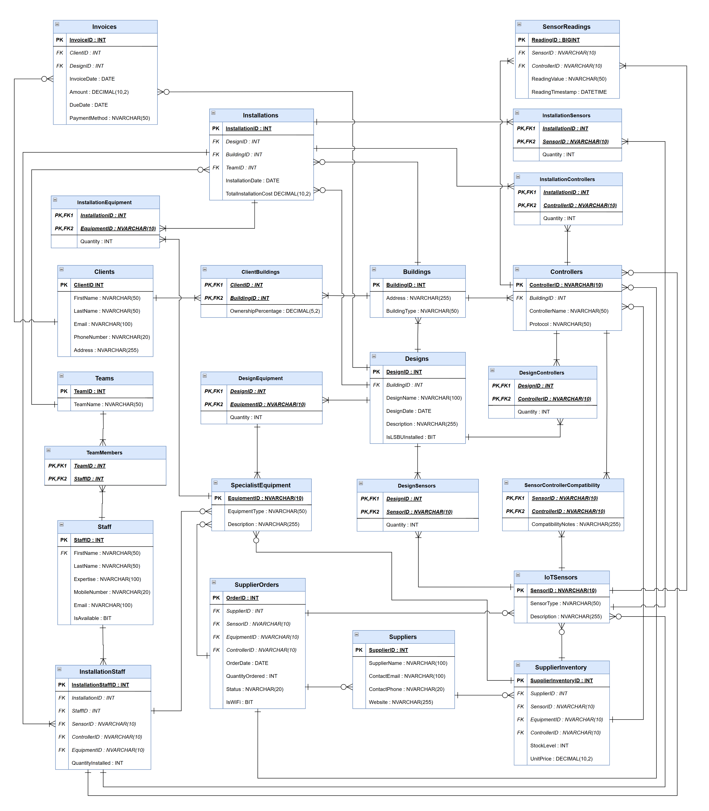

# Smart Home Information System


> A relational database and business intelligence solution for a fictional smart home IoT company — covering full database lifecycle from conceptual design to interactive Power BI reporting.

---

## Table of Contents

- [Project Overview](#project-overview)
- [Business Context](#business-context)
- [Key Features](#key-features)
- [Database Design](#database-design)
- [SQL Implementation](#sql-implementation)
- [Stored Procedures and Triggers](#stored-procedures-and-triggers)
- [Power BI Dashboard](#power-bi-dashboard)
- [Tech Stack](#tech-stack)
- [Project Structure](#project-structure)
- [Tasks Summary](#tasks-summary)
- [How to Run](#how-to-run)
- [Author](#author)

---

## Project Overview

This project is a prototype database and analytics solution designed for **LSBU Smart Home**, a fictional company specialising in smart home technology using Internet of Things (IoT) devices.

The solution covers the full data lifecycle: conceptual design, relational schema normalisation, SQL implementation with realistic test data, advanced querying, business logic enforcement through stored procedures and triggers, and a Power BI dashboard for operational reporting.

The project was developed as part of academic coursework at London South Bank University (LSBU) and demonstrates practical skills in database design, T-SQL programming, and business intelligence.

---

## Business Context

LSBU Smart Home designs, installs, and maintains IoT-based smart home systems for residential and commercial clients. The business operates across several key domains:

- Serves multiple clients, each owning or sharing one or more buildings
- Installs and maintains a range of IoT sensors and controllers (motion detectors, smoke sensors, HD-CCTV cameras, and more)
- Manages supplier relationships, device inventories, and compatibility tracking
- Allocates specialist staff to installation projects based on availability and skills
- Plans to expand into remote control applications and cloud-based data management
- Requires automated invoicing, smart operational analytics, and flexible payment processing

The database system was designed to support all of these operational needs in a structured, normalised, and queryable format.

---

## Key Features

- Entity Relationship Diagram (ERD) covering all core business entities and their relationships
- Full normalisation to Third Normal Form (3NF) and Boyce-Codd Normal Form (BCNF)
- MS SQL Server implementation with 20+ realistic test records per table
- Advanced SQL queries for business reporting and operational analysis
- Stored procedure for dynamic installation cost reporting with time-based filters
- Trigger to prevent double-booking of specialist staff
- Interactive Power BI dashboard visualising key business metrics

---

## Database Design

### Entity Relationship Diagram

The ERD captures all core entities of the LSBU Smart Home business domain:



Key entities include: Clients, Buildings, Designs, IoT Devices, Sensors, Suppliers, Staff, and Installations.

Relationships reflect real business rules — for example, a client can own multiple buildings, a building can have multiple installations, and each installation is assigned to one or more staff members.

### Normalisation

The schema was designed from first principles using functional dependency analysis and normalised progressively through 1NF, 2NF, 3NF, and BCNF. This eliminates redundancy, prevents update anomalies, and ensures data integrity across all tables.

---

## SQL Implementation

The `DatabaseScript.sql` file contains the full database creation script, including:

- Table definitions with primary keys, foreign keys, and constraints
- Realistic test data (20+ rows per table) covering all business scenarios
- Referential integrity enforced through foreign key relationships

The `SQLQuery2.sql` file contains advanced analytical queries, including:

- Identify clients with the highest and lowest design costs
- Analyse supplier order statuses (complete, incomplete, and cancelled)
- Check availability of specialist staff by role and date
- Retrieve installation history filtered by client, building, or time period

---

## Stored Procedures and Triggers

### Stored Procedure — Dynamic Costed Installation Report

A parameterised stored procedure generates a detailed installation cost report. The time period can be filtered dynamically by week, month, or quarter. The report includes installation details, assigned staff, device costs, and total charges per project.

### Trigger — Staff Double-Booking Prevention

A database trigger enforces the business rule that a staff member cannot be assigned to two installations at the same time. Any insert or update that would cause a scheduling conflict is automatically blocked, and an error message is raised.

---

## Power BI Dashboard

The `PowerBi Dashboard.pbix` file connects to the SQL Server database and visualises key operational metrics, including:

- Client activity and installation volume over time
- Installation costs by client, building, and time period
- Staff assignment and workload distribution
- Supplier order status breakdown
- Device inventory and usage by type

The dashboard is designed for operational managers to monitor business performance at a glance.

---

## Tech Stack

| Category | Tools |
|---|---|
| Database | Microsoft SQL Server |
| Query Language | T-SQL (Transact-SQL) |
| Business Intelligence | Power BI Desktop |
| ERD Design | draw.io |
| Schema Visualisation | ERD.png (exported diagram) |

---

## Project Structure

```
LSBU-Smart-Home/
│
├── DatabaseScript.sql        # Full database schema and test data
├── SQLQuery2.sql             # Advanced analytical SQL queries
├── ERD SourceFile.drawio     # Editable ERD source file (draw.io)
├── ERD.png                   # Entity Relationship Diagram (exported image)
├── PowerBi Dashboard.pbix    # Power BI report file
└── README.md
```

---

## Tasks Summary

| Task | Description | Status |
|---|---|---|
| ERD Design | Entity-relationship diagram with entities, keys, and attributes | Complete |
| Normalisation | Functional dependency analysis to 3NF and BCNF | Complete |
| SQL Implementation | Normalised tables and realistic test data | Complete |
| Advanced SQL Queries | Business queries with output and explanation | Complete |
| Stored Procedure | Dynamic costed installation report with time filters | Complete |
| Trigger | Staff scheduling conflict prevention | Complete |
| Power BI Dashboard | Interactive BI dashboard connected to the database | Complete |

---

## How to Run

**1. Set up the database**

Open `DatabaseScript.sql` in Microsoft SQL Server Management Studio (SSMS) and execute the script. This creates all tables and populates them with test data.

**2. Run the queries**

Open `SQLQuery2.sql` in SSMS and run individual queries to explore the analytical outputs.

**3. Open the Power BI dashboard**

Open `PowerBi Dashboard.pbix` in Power BI Desktop. Update the data source connection to point to your local SQL Server instance, then refresh the data.

---

## Author

**Victor Pavel**
Data Analyst | London, UK
[LinkedIn](https://linkedin.com/in/victorctin/)
[GitHub](https://github.com/victorctin)
